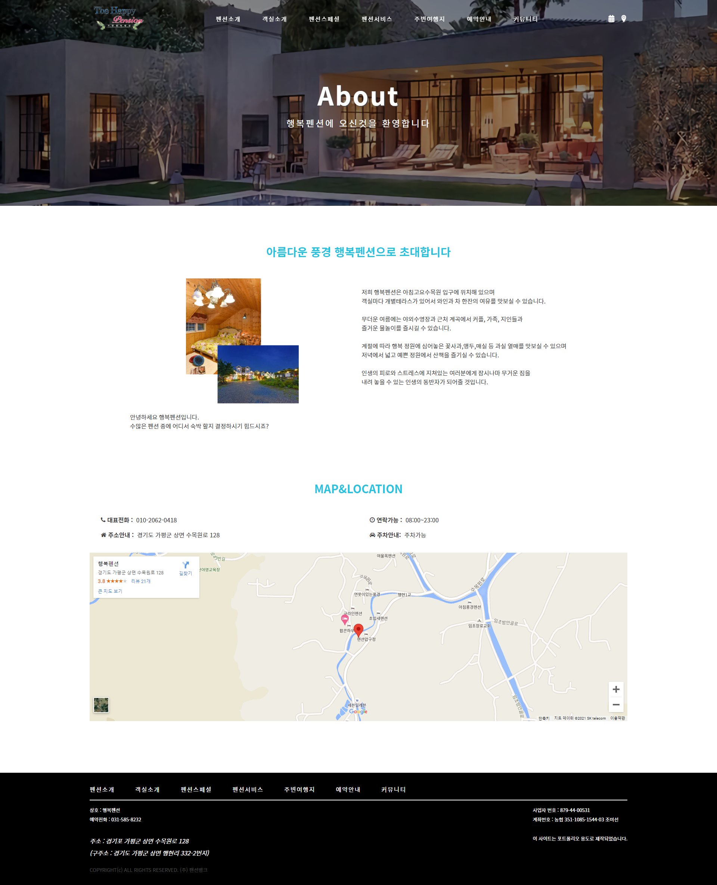
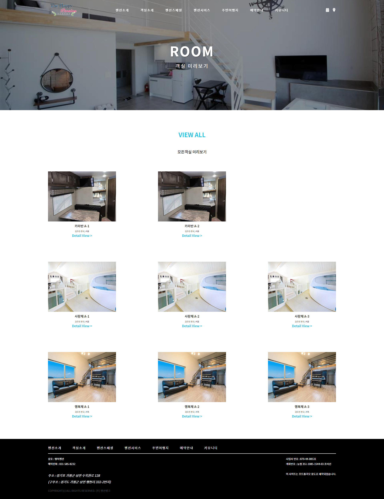
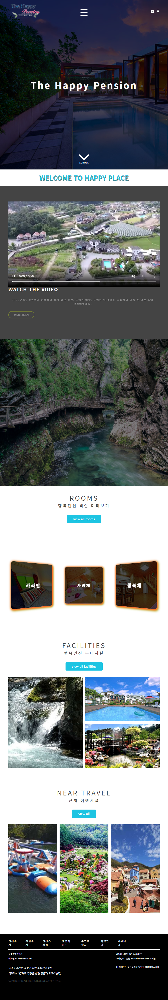
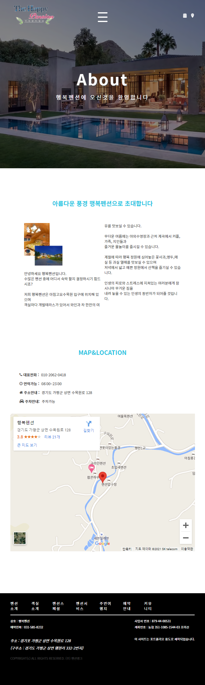
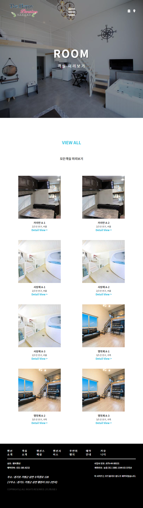

# 행복펜션 포트폴리오

팀 과제 : 박효준, 이소윤, 김효정, 장경선

## 목차

- [행복펜션 포트폴리오](#행복펜션-포트폴리오)
  - [목차](#목차)
  - [링크](#링크)
  - [스크린샷](#스크린샷)
    - [데스크탑](#데스크탑)
    - [모바일](#모바일)
  - [작업내용](#작업내용)
    - [사용 스킬](#사용-스킬)
    - [공부](#공부)
  - [리뉴얼 전 작품](#리뉴얼-전-작품)

## 링크

-   [LiveSite](https://hyojuns.github.io/Rentalcottage-project/)

## 스크린샷

### 데스크탑

-   그 외는 알아서 확인바람

### 모바일

## 작업내용

### 사용 스킬

-   HTML 5
-   CSS
    -   Grid
    -   Flex
-   JavaSCript
-   Jquery
-   animeJS (아주조금)

### 공부

-   다양한것을 도전해 봤다.

## 리뉴얼 전 작품

[접속하기](http://www.gphappy.kr/)
